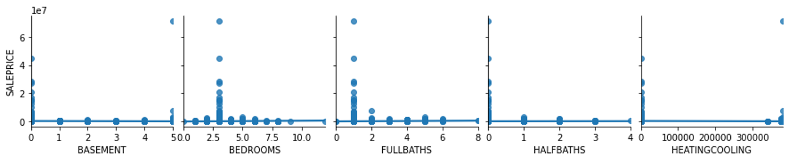
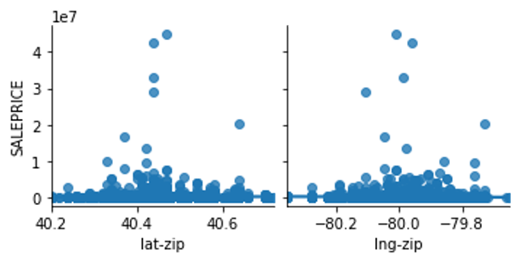
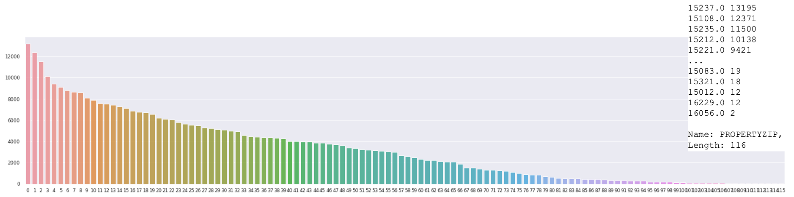
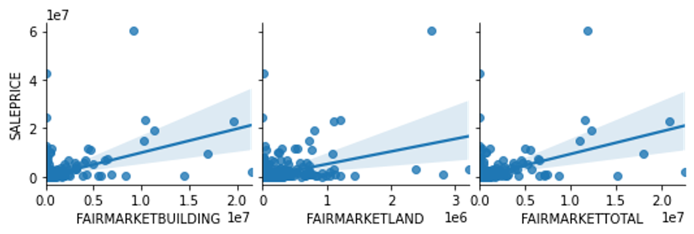
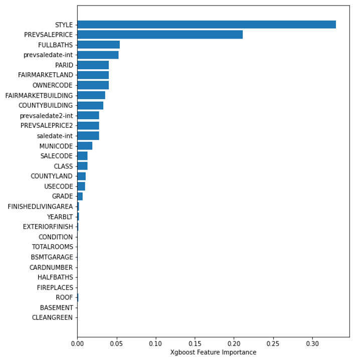
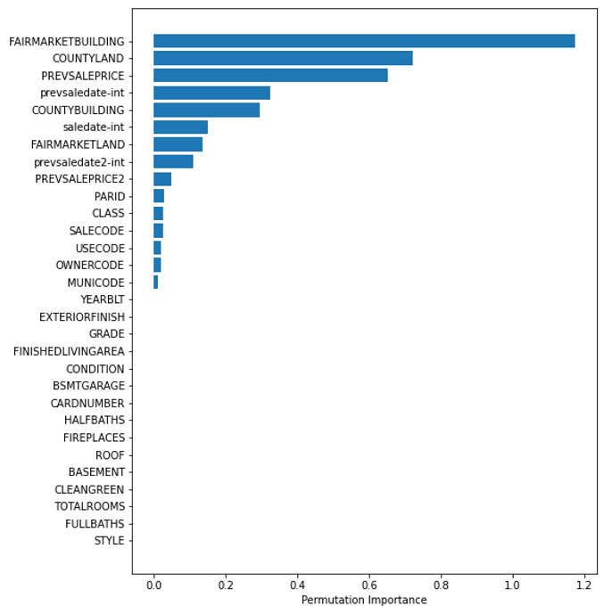
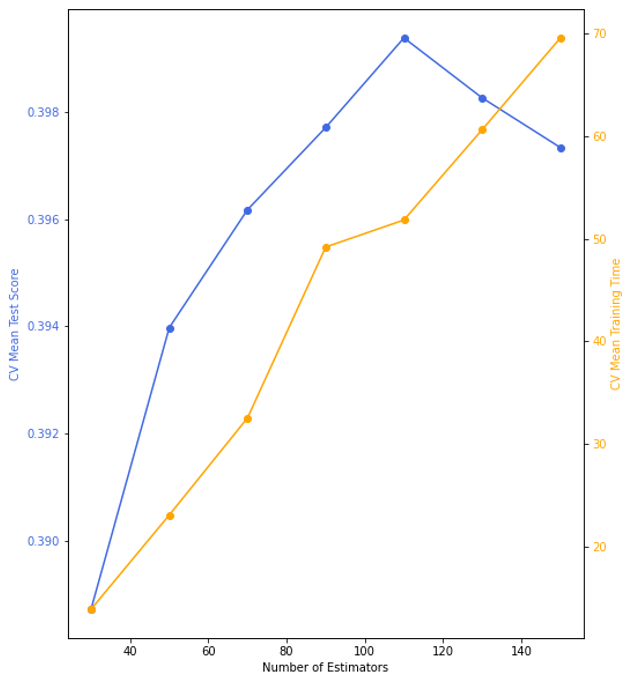
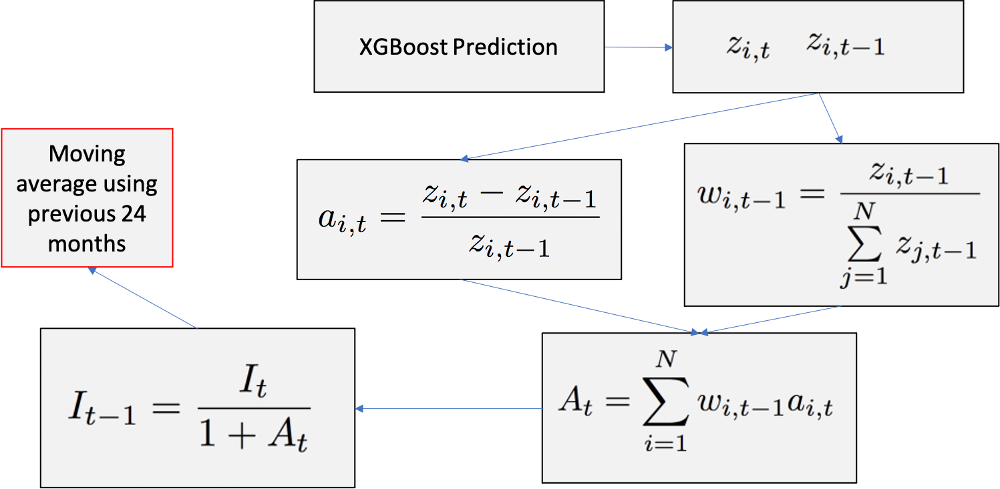
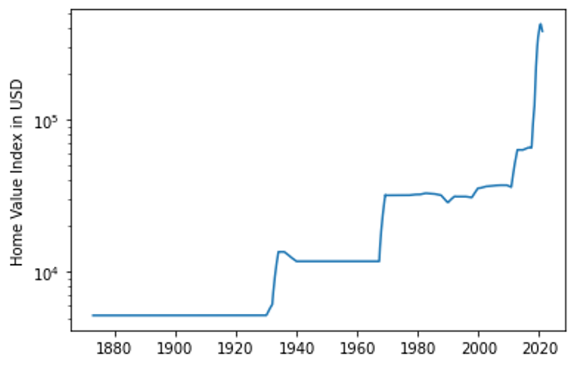

You may also execute the code presented in this analysis using [DeepNote](http://fer.me/fidelity-nb).

# About Matheus C. Fernandes
I am a finishing PhD candidate in Applied Mathematics at Harvard University School of Engineering and Applied Sciences. As a NSF-GRFP fellow, my PhD thesis involves numerically modeling bio-inspired optimized materials and applying generative parametric machine learning algorithms to control soft robotic actuators and classify objects based on embedded sensor data. You may watch a TED-style talk on my research work on [Youtube](https://youtu.be/u16FjNGMoEs).

I have earned a Masters of Science (S.M.) in Computational Science and Engineering in 2020 from Harvard and earned a terminal Masters of Engineering (M.Eng.) in Engineering Sciences with a concentration in Mechanical Engineering and Material Science in 2015 also from Harvard. My M.Eng. thesis was on modeling 'Mechanics of Subglacial Hydrology under Supraglacial Lakes and Ice Stream Shear Margins'. 

To learn more about my research interests and find a list of publicaitons, please visit my website at [mcfernandes.com](http://mcfernandes.com). You may also find my full CV and Resume [here](./about.html).

# About Allegheny County

Located inin the southwest of the U.S. state of Pennsylvania. As of 2019 the population was 1,216,045, making it the state's second-most populous county, following Philadelphia County. The county seat is Pittsburgh. Allegheny County is included in the Pittsburgh, PA Metropolitan Statistical Area, and in the Pittsburgh Designated Market Area.

# Project Goal
Develop a monthly “Allegheny County Home Value Index” (HVI) to understand key features of the market. Create model to gain insights for investment opportunities.

# About the Dataset
The dataset can be obtained from the [Western PA Regional Data Center](https://data.wprdc.org/dataset/property-assessments), which can be downloaded directily from [here](https://www.dropbox.com/s/ordhz0pszt4v4x7/assessments.csv?dl=1). Each of the features contained in the dataset are explained in [this document](./assets/property-assessment-data-dictionaryrev.pdf).

# Data Cleaning
This portion of the project can be found on [Github](https://github.com/matheuscfernandes/fidelity-interview/blob/main/1-DataCleaning.ipynb) and [Deepnote](https://deepnote.com/project/4d883e40-705b-4ee7-9326-895000a955f5#%2F1-DataCleaning.ipynb)

In order to ensure adequate and properly labeled data, I performed a strict data cleaning procedure. I removed data that is missing important information such as 

- Sale price
- Sale date
- Sale price is 0 or unreasonably low (<$1000)

For other less important features, I attempted to not loose the information contained in columns not missing data, but at the same time not introduce noise into the data. To achieve this, I employed a few different strategies, depending on the date, namely:

- Created new category of unknonw, zeros, or boolean
- Replaced missing data with mean from other data for continuous variables
- Imputed information from different columns where it made sense, namely, previous sale date and previous sale date 2

Also to ensure computational efficiency, I converted 64bit integers to 32- and 8-bit integers. This reduced the data in memory from ~380MB to ~120MB without loosing any information.

In an attempt at feature engineering, I tired converting street addresses into latitude and longitude geolocations, but because the free API was extremely slow, I decided to perform this on the zipcode level instead of the property level. I then encoded the zipcode into latitude and longitudes. By comparing the granualrity between these two I made the decision to pursue only keeping the zipcode level.

Lastly, to ensure proper weighting between features, I standardized the dataset.

# Exploratory Data Analysis
This portion of the project can be found on [Github](https://github.com/matheuscfernandes/fidelity-interview/blob/main/2-ExploratoryDataAnalysis.ipynb) and [Deepnote](https://deepnote.com/project/4d883e40-705b-4ee7-9326-895000a955f5#%2F2-ExploratoryDataAnalysis.ipynb)

I performed Exploratory Data Analysis on the data before considering any models. This allows me to understand the effects of each of the variables on the target data of interest, namely, each properties sale price.

The first variable I explore is sale date. To understand how the price varies with time, I plot the price in a semilog y axis as a function of time.  

The first question I attempt in answering is wether this time series is martingale. For it to be a martingale, the random variable must follow the following conditional expectation constraints:

By fitting an exponential line, we see that the expectation follows an exponential growth, namely, $y=ae^{bx}$

The next thing to look at is the correlation between variables. To do that I plot the correlation matrix. This provides information on correlation of variables. No correlation does not mean no useful information. But high correlation between variables means potential redundancy between those variables.

Next, I do a deeper dive into the data to udnerstand wow does each variable depends on the other. This can help me look for trends in the data and see how property sale price depends on each feature.

### How do house properties impact pricing?

From the plot below, I see that the properties features can impact pricing. Most of it is concentrated into properties that meet certain criteria -- likely due to proximity to city centers. Bigger is not neccessarily higher price.

### How does location impact pricing?

From the plot below, I see that location can impact property valuations. Mostly concentrated at the center, which is the downtown area of Pittsburgh.

### What is the distribution of the data across different locations?

Most of the data in the dataset is located in a few zipcode. This could lead to problems in the prediction as most of the information we have is concentrated in certain locations.

### How do the assessments impact pricing?

From the plot below, I see that there is a positive correlation between property sale price and fair market assessement. This is expected since the goal of the assessment is to predict the value of a peroperty. Coversely, we also see that the assessement is, in my opinion, not doing a good enough job of predicting the sale price. My goal here is to do better job predicting the sale price than the official assessement. 😄

# Model Exploration
This portion of the project can be found on [Github](https://github.com/matheuscfernandes/fidelity-interview/blob/main/3-ModelExploration.ipynb) and [Deepnote](https://deepnote.com/project/4d883e40-705b-4ee7-9326-895000a955f5#%2F3-ModelExploration.ipynb)

**Model Goal:** Predict valuation of existing homes for a variable sale date.  

**Target variable:** Sale Price

**Input variables:** Sale date and important features that provide information on the valuation of a property at a certain date

**Model Assumptions:**

- No information on the buyers side (demand)
- No listing prices or spread of ask/bid
- No information on interest rates
- No demographic information
- No information on the economy
- No refined information on location
- Based on assessments only from 2021 (dataset)
- Discrete daily sampling 

**Seek these regression model characteristics:**

- Deal with sparse data
- Good for dealing with categorical and numerical data
- Efficient at training (limited computational resources on my end)
- Scalable to potentially adding more data in the future

## Model Performances

|     Model                                  |     Train Score    |     Test Score    |
|--------------------------------------------|:------------------:|:-----------------:|
|     Linear Model: LassoCV                  |        0.573       |        0.495      |
|     Support Vector Machine (SD)            |        0.201       |        0.007      |
|     Ensemble: Random Forest                |        0.900       |        0.523      |
|     Ensemble: Bagging                      |        0.930       |        0.588      |
|     Ensemble: Adaptive Boosting (SD)       |        0.829       |        0.380      |
|     Ensemble: Extreme Gradient Boosting    |        0.814       |        0.767      |

*Scores are measured using R2 Score: 1-(sum of square residuals/total sum of squares)

SD = sampled dataset

### About XGBoost
This is a decision-tree-based ensemble model that Uses gradient boosting framework to convert weak to strong learner through sequential learning
Gradient descent algorithm. This method is great for small-to-medium structured/tabular data and is boosting optimized for software and hardware parallelization.

## Another Level Feature Selection
### Feature Importance
This importance measure is based on the Gini importance of decision trees defined by:

Looking at each of the features importance measure, we can rank them from highest to lowest and plot them as seen below. The higher the importance the more crucial the feature is for the prediction.

### Permutation Importance
For the permutation importance, the algorithm computes a score for the model and then, for each feature, shuffles the column and compute score for corrupted dataset. Then, based on how much it impacts the accuracy of the prediction (in the form of error) it provides a measure of how important a feature is. The higher the importance the more crucial a particular feature is for the model.

## Hyper Parameter Tuning

For computational efficiency, only tuned 1 param – number of estimators

Use cross-validation with 4-way split

A bias-variance balance is obtained at n=110, with underfitting before and overfitting after

As n increases computational time increases

# Computing HVI
This portion of the project can be found on [Github](https://github.com/matheuscfernandes/fidelity-interview/blob/main/4-ComputingHVI.ipynb) and [Deepnote](https://deepnote.com/project/4d883e40-705b-4ee7-9326-895000a955f5#%2F4-ComputingHVI.ipynb)

## Method

## Results

# Conclusions and Recommendations

Based on the resutls obtained from the model alone under the stated assumptions, I do not suggest investing in the housing stock on Allegheny county at the moment. If the costumer currenly holds properties holdings at the moment, I would recommend liquidating the assets 

However, uncertainties arising  unaccounting for additional 

# 