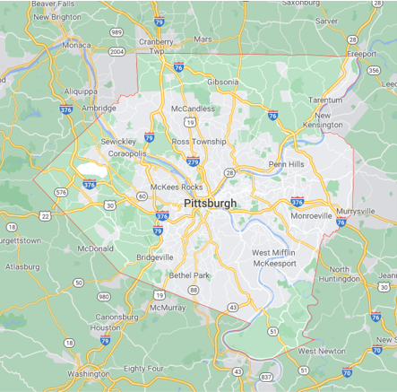
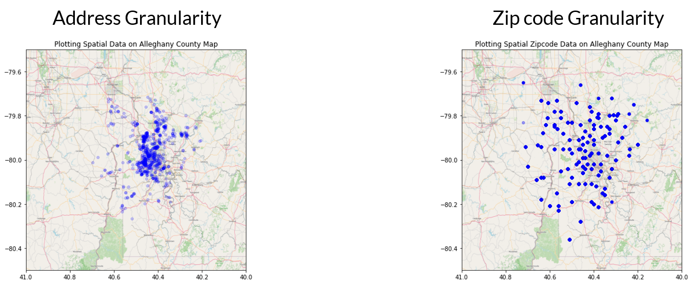
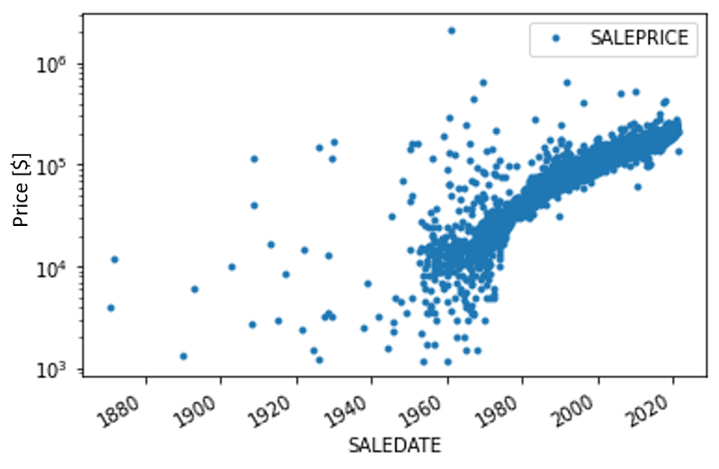
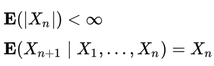
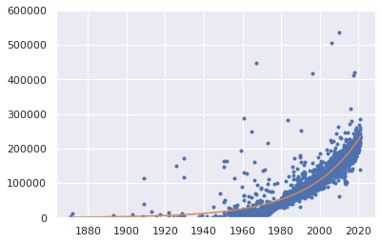
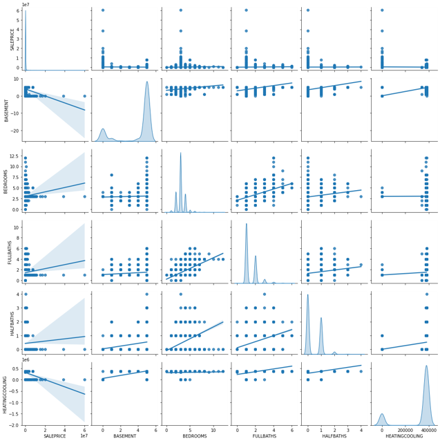

You may also execute the code presented in this analysis using [DeepNote](http://fer.me/fidelity-nb).

# About Matheus C. Fernandes
I am a finishing PhD candidate in Applied Mathematics at Harvard University School of Engineering and Applied Sciences. As a NSF-GRFP fellow, my PhD thesis involves numerically modeling bio-inspired optimized materials and applying generative parametric machine learning algorithms to control soft robotic actuators and classify objects based on embedded sensor data. You may watch a TED-style talk on my research work on [Youtube](https://youtu.be/u16FjNGMoEs).

I have earned a Masters of Science (S.M.) in Computational Science and Engineering in 2020 from Harvard and earned a terminal Masters of Engineering (M.Eng.) in Engineering Sciences with a concentration in Mechanical Engineering and Material Science in 2015 also from Harvard. My M.Eng. thesis was on modeling 'Mechanics of Subglacial Hydrology under Supraglacial Lakes and Ice Stream Shear Margins'. 

To learn more about my research interests and find a list of publicaitons, please visit my website at [mcfernandes.com](http://mcfernandes.com). You may also find my full CV and Resume [here](./about.html).


# About Allegheny County


Located inin the southwest of the U.S. state of Pennsylvania. As of 2019 the population was 1,216,045, making it the state's second-most populous county, following Philadelphia County. The county seat is Pittsburgh. Allegheny County is included in the Pittsburgh, PA Metropolitan Statistical Area, and in the Pittsburgh Designated Market Area.

# Project Goal
Develop a monthly “Allegheny County Home Value Index” (HVI) to understand key features of the market. Create model to gain insights for investment opportunities.

# About the Dataset
The dataset can be obtained from the [Western PA Regional Data Center](https://data.wprdc.org/dataset/property-assessments), which can be downloaded directily from [here](https://www.dropbox.com/s/ordhz0pszt4v4x7/assessments.csv?dl=1). Each of the features contained in the dataset are explained in [this document](./assets/property-assessment-data-dictionaryrev.pdf).

# Data Cleaning
In order to ensure adequate and properly labeled data, I performed a strict data cleaning procedure. I removed data that is missing important information such as 

- Sale price
- Sale date
- Sale price is 0 or unreasonably low (<$1000)

For other less important features, I attempted to not loose the information contained in columns not missing data, but at the same time not introduce noise into the data. To achieve this, I employed a few different strategies, depending on the date, namely:

- Created new category of unknonw, zeros, or boolean
- Replaced missing data with mean from other data for continuous variables
- Imputed information from different columns where it made sense, namely, previous sale date and previous sale date 2

Also to ensure computational efficiency, I converted 64bit integers to 32- and 8-bit integers. This reduced the data in memory from ~380MB to ~120MB without loosing any information.

In an attempt at feature engineering, I tired converting street addresses into latitude and longitude geolocations, but because the free API was extremely slow, I decided to perform this on the zipcode level instead of the property level. I then encoded the zipcode into latitude and longitudes. By comparing the granualrity between these two I made the decision to pursue only keeping the zipcode level.



Lastly, to ensure proper weighting between features, I standardized the dataset.

# Exploratory Data Analysis












# Model Exploration

# Computing HVI
## Method

## Assumptions

# Conclusions

Based on the resutls obtained from the model alone under the stated assumptions, I do not suggest investing in the housing stock on Allegheny county at the moment. If the costumer currenly holds properties holdings at the moment, I would recommend liquidating the assets 

However, uncertainties arising  unaccounting for additional 


<!-- Text can be **bold**, _italic_, or ~~strikethrough~~.

[Link to another page](./another-page.html).

There should be whitespace between paragraphs.

There should be whitespace between paragraphs. We recommend including a README, or a file with information about your project.

# Header 1

This is a normal paragraph following a header. GitHub is a code hosting platform for version control and collaboration. It lets you and others work together on projects from anywhere.

## Header 2

> This is a blockquote following a header.
>
> When something is important enough, you do it even if the odds are not in your favor.

### Header 3

```js
// Javascript code with syntax highlighting.
var fun = function lang(l) {
  dateformat.i18n = require('./lang/' + l)
  return true;
}
```

```ruby
# Ruby code with syntax highlighting
GitHubPages::Dependencies.gems.each do |gem, version|
  s.add_dependency(gem, "= #{version}")
end
```

#### Header 4

*   This is an unordered list following a header.
*   This is an unordered list following a header.
*   This is an unordered list following a header.

##### Header 5

1.  This is an ordered list following a header.
2.  This is an ordered list following a header.
3.  This is an ordered list following a header.

###### Header 6

| head1        | head two          | three |
|:-------------|:------------------|:------|
| ok           | good swedish fish | nice  |
| out of stock | good and plenty   | nice  |
| ok           | good `oreos`      | hmm   |
| ok           | good `zoute` drop | yumm  |

### There's a horizontal rule below this.

* * *

### Here is an unordered list:

*   Item foo
*   Item bar
*   Item baz
*   Item zip

### And an ordered list:

1.  Item one
1.  Item two
1.  Item three
1.  Item four

### And a nested list:

- level 1 item
  - level 2 item
  - level 2 item
    - level 3 item
    - level 3 item
- level 1 item
  - level 2 item
  - level 2 item
  - level 2 item
- level 1 item
  - level 2 item
  - level 2 item
- level 1 item

### Small image


### Large image


### Definition lists can be used with HTML syntax.

<dl>
<dt>Name</dt>
<dd>Godzilla</dd>
<dt>Born</dt>
<dd>1952</dd>
<dt>Birthplace</dt>
<dd>Japan</dd>
<dt>Color</dt>
<dd>Green</dd>
</dl>

```
Long, single-line code blocks should not wrap. They should horizontally scroll if they are too long. This line should be long enough to demonstrate this.
```

```
The final element.
``` -->
